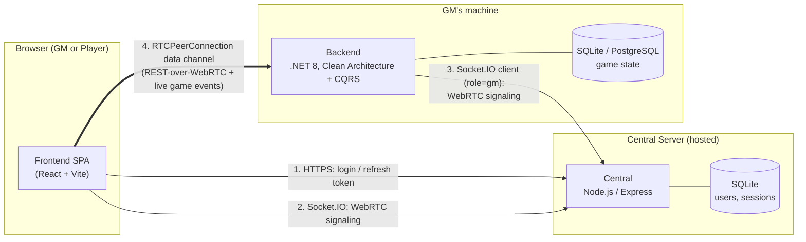
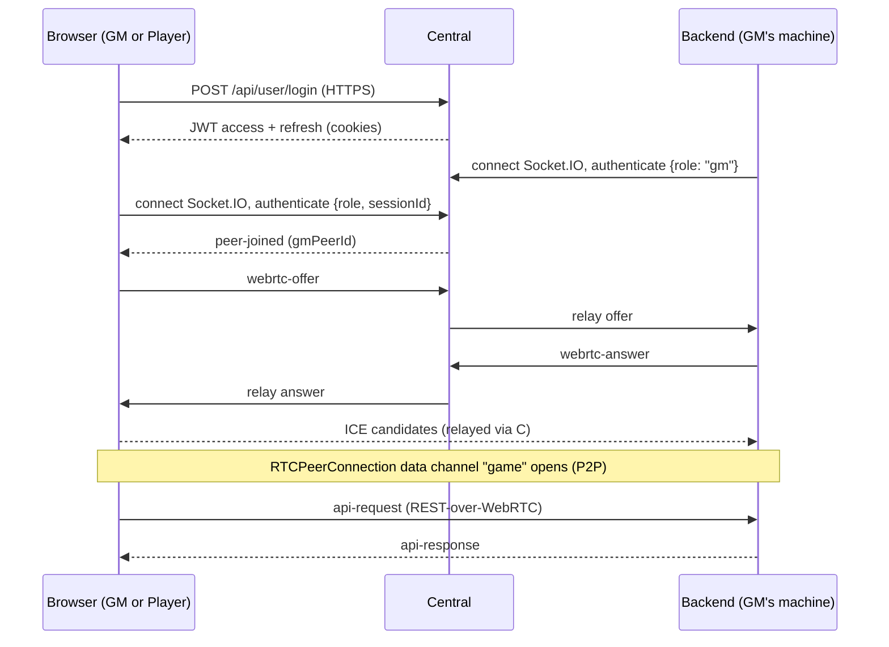

# NordvikManager

This is main repository of Nordvik Manager.

**Warning**
**This application is currently in an alpha state and may contain bugs or incomplete features. Use it at your own risk.**

## Overview

Nordvik Manager is an open source Virtual Table Top software that is aiming to include all most necessary features required for playing over internet with friends. We are focusing to make this application easy to extend and modify.

## Features

This section is in progress...

---

# For Players

You don't need to install anything to join a game — only the GM running the session does.

- **Joining a game (Player):** open [nordvikmanager.pl/client](https://nordvikmanager.pl/client) in your browser. It always serves the newest released frontend build and connects you to whichever GM's session you've been invited to.
- **Running a game (GM):** GMs install and run the Backend application locally (see [Installation](#installation) below), then access it through `localhost` in their browser to create and manage the session — players then join remotely through `nordvikmanager.pl/client` without installing anything themselves.
- **Quick start guide:** [nordvikmanager.pl/quickstart](https://nordvikmanager.pl/quickstart) — walks GMs through installing the app and setting up their first session.
- **User guide:** [nordvikmanager.pl/user-guide](https://nordvikmanager.pl/user-guide) — full documentation for Players and GMs.

## Installation

Feel free to download release [here](https://github.com/haffff/NordvikManager/releases)

---

# For GMs / Developers

More technical details on how the application is put together — useful if you're self-hosting, contributing, or building an addon.

- **Documentation:** [nordvikmanager.pl/documentation](https://nordvikmanager.pl/documentation)
- **Addon development guide:** [nordvikmanager.pl/addon-guide](https://nordvikmanager.pl/addon-guide)

## Architecture

Nordvik Manager is split across three repositories that talk to each other over WebRTC (game data) and Socket.IO (signaling only):

- **[Frontend](https://github.com/haffff/NordvikManagerFrontEnd)** — React SPA (Vite). One codebase serves both the GM and Player roles.
- **[Backend](https://github.com/haffff/NordvikManager-Backend)** ("GM Local Server") — .NET 8, Clean Architecture + CQRS. Runs on the GM's own machine and owns the actual game state (SQLite/PostgreSQL). It never listens for inbound connections directly from players — see below.
- **[Central](https://github.com/haffff/NordvikManager-Central)** — Node.js/Express server, hosted centrally. Handles account auth (JWT) and relays WebRTC signaling between browsers and the GM's Backend. It never sees game data — it's a pure relay plus a session/user registry (SQLite).



Once the data channel is open, all in-game traffic (REST calls, token moves, chat, map switches) flows directly peer-to-peer between the browser and the GM's Backend — Central is only involved in steps 1-3:



## Development setup

This repo is a workspace manager for the whole stack — it doesn't contain application code itself, just `repos.json`/`NordvikManager-Addons/addons.json` manifests and scripts (in `scripts/`) to clone, install, and run every component together.

```bash
pnpm install
pnpm run repos:clone    # clones Frontend, Backend, Central, etc. from repos.json next to this repo (skips ones already present)
pnpm run addons:clone   # clones every addon repo listed in NordvikManager-Addons/addons.json into addons/<key>
                         # pass a key to clone just one, e.g. `pnpm run addons:clone -- dnd5e`
pnpm run install-all    # installs dependencies for every cloned repo — pnpm/npm/dotnet, auto-detected per repo
pnpm run dev            # runs Central, Backend, and the Frontend (both GM and Player mode) concurrently
```

`pnpm run dev` is the fastest way to get the full stack running locally — it's `concurrently` wired to `pnpm --dir NordvikManager-Central run dev`, `pnpm --dir NordvikManagerFrontEnd run start_player`, `pnpm --dir NordvikManagerFrontEnd run start_gm`, and `dotnet run --project NordvikManager-Backend/DNDOnePlaceManager` — see `package.json` for the exact command. Each sub-repo's own README covers running it standalone (useful when you only need to iterate on one component).

## See also

[Nordvik Manager Frontend Repository](https://github.com/haffff/NordvikManagerFrontEnd)

[Nordvik Manager Backend Repository](https://github.com/haffff/NordvikManager-Backend)

[Nordvik Manager Central Repository](https://github.com/haffff/NordvikManager-Central)

[Addons repository](https://github.com/haffff/NordvikManager-Addons)

My addons:

[DND 5e repository (W.I.P.)](https://github.com/haffff/NordvikManager-DND)
